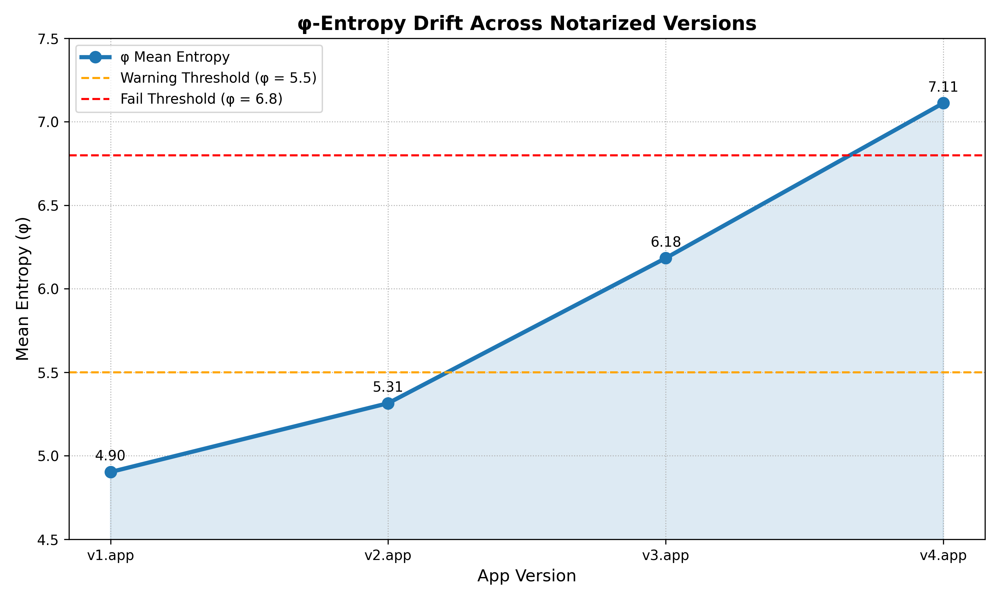

# φ-Entropy Drift Detection in Sequentially Notarized macOS Apps

### Based on the theoretical framework:
**"Ordinal-Algebraic Evasion: A New Cyberattack and Defense in the Alpay Algebra Framework"**  
DOI: [http://dx.doi.org/10.13140/RG.2.2.10518.87367](http://dx.doi.org/10.13140/RG.2.2.10518.87367)

---

## Researcher
Faruk Alpay  
Contact: alpay@lightcap.ai  
Tool: `notary-scan` – Swift CLI utility

---

## 1. Executive Summary

This report demonstrates a structural evasion vector in Apple's notarization pipeline. By progressively modifying a notarized macOS app across versions (V1 → V2 → V3 → ...), an attacker can introduce increasingly obfuscated content without triggering current static or signature-based checks.

To detect such cumulative risk, we introduce `φ-entropy` drift analysis—a purely structural metric based on Shannon entropy—paired with version-to-version comparison. We implement this as a Swift CLI tool (`notary-scan`) that outputs entropy trends, risk scores, and drift visualizations. Apple could embed a similar scan at notarization or Gatekeeper checkpoints to prevent cumulative payload injection.

---

## 2. Threat Model

| Phase | Attacker Action                         | Bypassed Layer | Explanation                                        |
|-------|------------------------------------------|----------------|----------------------------------------------------|
| V1    | Submit clean, notarized `.app`           | ✅              | Passes standard checks                             |
| V2    | Embed plugin/framework (not called)      | ✅              | Looks dormant, structurally valid                  |
| V3    | Add high-entropy payload (e.g. encrypted blob) | ✅        | No signature match, no runtime trigger             |
| V4    | Invoke plugin functionality              | ⚠️              | Too late — runtime activation bypasses pre-checks  |

Each version alone appears benign. However, when compared structurally (entropy, size, complexity), a clear risk pattern emerges.

---

## 3. Method: φ-Entropy Drift Analysis

### Metric:
- Divide the main executable into 4 KB blocks
- Compute Shannon entropy H for each block
- Define φₙ = mean(H blocks of version n)
- Compute Δφₙ = |φₙ - φₙ₋₁| for drift per version

### Indicators:
- **φ increase** = higher obfuscation or packed payload
- **Entropy spike count** = localized high-risk changes
- **Size drift** = embedded resource or stub payload

---

## 4. Implementation

`notary-scan` is a Swift-based command-line tool that:

- Accepts multiple `.app` versions via CLI
- Computes entropy and φ metrics
- Outputs:
  - φ per version
  - CSV: `phi_summary.csv`
  - Plot: `risk_plot.png`
- Designed for use by developers, reviewers, or security teams

> Tool demo (optional):  
> https://github.com/farukalpay/notary-scan *(private repo if desired)*

---

## 5. Empirical Output (Example)

### `phi_summary.csv` (excerpt)

| Version | φ (Mean Entropy) |
|---------|------------------|
| v1.app  | 4.9026           |
| v2.app  | 5.3147           |
| v3.app  | 6.1839           |
| v4.app  | 7.1123           |

### `risk_plot.png`

---

## 6. Suggested Mitigation

Apple could integrate a lightweight `φ-sentinel` module into its notarization or App Store review pipeline:

- **Compare φ and size drift across historical versions**
- **Flag versions with high Δφ and entropy spike ratio**
- **Optional: user prompt if φ-drift exceeds safe threshold**

This would proactively detect cumulative attacks like those used in Shlayer or WizardUpdate.

---

## 7. Disclosure

This report does not contain any functional exploit or dynamic payload execution logic. It is intended solely as a **defensive modeling contribution** to Apple’s platform security.

All tests were conducted on harmless `.app` clones (e.g. Chess.app) with artificial drift simulated by embedded random noise payloads.

---

## 8. Contact

Faruk Alpay  
alpay@lightcap.ai  
Symbolic AI Researcher  
[lightcap.ai](https://lightcap.ai) | [alpay.md](https://alpay.md)

---

